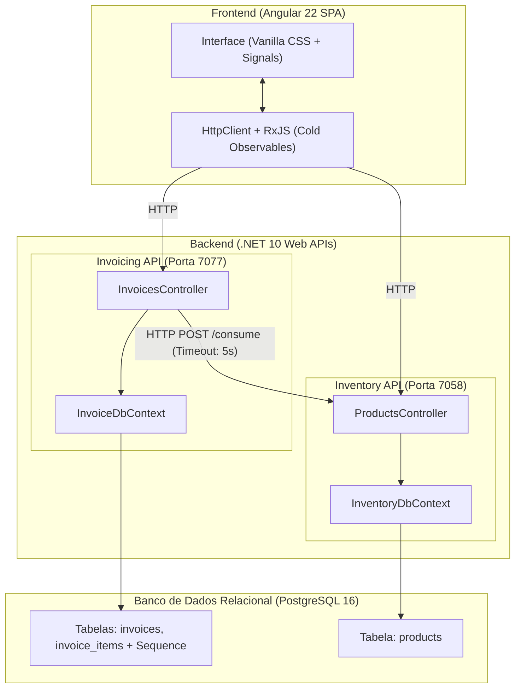

# Detalhamento Técnico da Solução: Sistema de Emissão de Notas Fiscais e Controle de Estoque

**Candidato:** João Marcos Silva  
**Vaga:** Estágio de Desenvolvimento | C# ou Go + Angular  
**Empresa:** Korp Informática Ltda  
**Repositório:** [https://github.com/joao-m-csilva/Korp_Teste_JoaoMarcosSilva](https://github.com/joao-m-csilva/Korp_Teste_JoaoMarcosSilva)

---

## 1. Visão Geral da Arquitetura e Decisões de Design

A solução foi projetada sob o paradigma de **Arquitetura de Microsserviços**, desacoplando os domínios de negócio em dois serviços de backend independentes e uma aplicação frontend em **Single Page Application (SPA)**, com infraestrutura totalmente containerizada em **Docker**.



### Principais Decisões Arquiteturais:
1. **Desacoplamento de Domínio:** O serviço de Faturamento (`Invoicing API`) não acessa diretamente as tabelas de estoque no banco de dados. Qualquer operação de baixa ou consulta de saldo é mediada exclusivamente por contratos de API REST via protocolo HTTP.
2. **Isolamento de Persistência:** Embora ambos os serviços compartilhem o mesmo servidor PostgreSQL orquestrado no Docker, cada microsserviço possui seu próprio `DbContext` isolado, garantindo governança estrita sobre seus próprios dados e migrações.
3. **Resiliência e Tolerância a Falhas:** A comunicação entre microsserviços foi blindada contra lentidão e quedas de serviço através de timeouts configurados e captura de exceções de rede com retorno de status HTTP apropriado.

---

## 2. Frontend (Angular 22)

### 2.1. Frameworks e Bibliotecas Utilizadas
* **Angular 22:** Utilização dos recursos mais modernos do ecossistema Angular:
  * **Standalone Components:** Eliminação do overhead de `NgModule`, tornando os componentes modulares e de carregamento eficiente via Lazy Loading no roteador.
  * **Angular Signals (`signal`, `computed`):** Primitiva reativa moderna para gerenciamento de estado fino e atualização pontual de nós do DOM sem necessidade de re-renderização total da árvore de componentes.
  * **Novo Control Flow (`@if`, `@for`):** Sintaxe nativa do Angular que substitui as antigas diretivas `*ngIf` e `*ngFor`, com melhoria significativa de performance e legibilidade.
* **RxJS (~7.8.0):** Biblioteca de programação reativa assíncrona integrada ao `HttpClient`.
* **@angular/forms (FormsModule):** Utilizado para two-way data binding em formulários reativos simples nos modais de cadastro.
* **@angular/router:** Gerenciamento de rotas e navegação SPA.
* **Vitest (~4.0.8) & JSDOM (~28.0.0):** Suite de testes unitários automatizados moderna e de alta performance.

### 2.2. Decisão sobre Bibliotecas Visuais (Componentes de UI)
* **Opção por Vanilla CSS (CSS Autoral):**
  * **Justificativa:** Optou-se por **não utilizar bibliotecas de terceiros pesadas** (como PrimeNG, Angular Material ou Bootstrap).
  * **Benefícios:**
    1. **Bundle Ultraleve:** Sem centenas de kilobytes de dependências não utilizadas.
    2. **Design System Dedicado:** Criação de layout responsivo, limpo e profissional com variáveis CSS (`tokens`), modais acessíveis, alertas visuais semânticos e ícones SVG inline.
    3. **Controle Total:** Facilidade de customização e aderência visual à identidade corporativa (Korp).

### 2.3. Ciclos de Vida do Angular Utilizados
* **`ngOnInit`:** Implementado nos componentes `Home`, `Products` e `Invoices`.
  * **Finalidade:** Como a aplicação opera como SPA, ao navegar pelas rotas, o componente é instanciado e o `ngOnInit` atua como o ponto de entrada seguro para disparar a carga inicial de dados via serviços HTTP.

```typescript
// Exemplo em src/app/products/products.ts
ngOnInit(): void {
  this.loadProducts();
}
```

### 2.4. Uso da Biblioteca RxJS e Padrão de Observables
* **Cold Observables (Unicast 1:1):** As chamadas geradas pelo `HttpClient` (`get()`, `post()`) operam como **Cold Observables**. A requisição HTTP só é efetivamente disparada no momento da subscrição (`.subscribe()`), recebendo exatamente uma resposta (ou erro) e completando o ciclo (`complete`) automaticamente.
* **Chamadas Desacopladas para Tolerância a Falhas:**
  * No painel inicial (`Home`) e na tela de `Invoices`, as chamadas para a API de Estoque e para a API de Faturamento foram intencionalmente estruturadas com subscrições independentes.
  * **Vantagem:** Se a API de Estoque estiver offline, a listagem de notas ou as métricas de faturamento continuam sendo exibidas normalmente na tela, com a exibição de um alerta pontual indicando apenas o serviço afetado.

```typescript
// Exemplo em src/app/home/home.ts: Requisições independentes
this.productService.getProducts().subscribe({
  next: (prods) => this.productsCount.set(prods.length),
  error: () => this.errorMessage.set('Serviço de Estoque indisponível no momento.')
});

this.invoiceService.getInvoices().subscribe({
  next: (invoices) => {
    // Processa métricas de faturamento
  },
  error: () => this.errorMessage.set('Serviço de Faturamento indisponível no momento.')
});
```

---

## 3. Backend (C# / .NET 10)

### 3.1. Frameworks e Gerenciamento de Dependências
* **Plataforma:** .NET 10 / ASP.NET Core Web API.
* **ORM:** Entity Framework Core 10 (`Microsoft.EntityFrameworkCore`, `Npgsql.EntityFrameworkCore.PostgreSQL`).
* **Documentação de API:** `Microsoft.AspNetCore.OpenApi` (OpenAPI/Swagger).
* **Gerenciamento de Dependências:** Gerenciado nativamente pelo **NuGet** através dos arquivos `.csproj` de cada projeto.

### 3.2. Estrutura dos Microsserviços
1. **`Korp.Inventory.API` (Porta 7058):**
   * Controla o catálogo de produtos e seus saldos.
   * `GET /api/products`: Listagem de produtos.
   * `GET /api/products/{id}`: Consulta individual.
   * `POST /api/products`: Cadastro com validações estritas de domínio.
   * `POST /api/products/consume`: Endpoint transacional de baixa em lote de estoque.
2. **`Korp.Invoicing.API` (Porta 7077):**
   * Gestão de notas fiscais e itens vinculados.
   * `GET /api/invoices`: Listagem de notas com itens relacionados.
   * `GET /api/invoices/{id}`: Consulta detalhada.
   * `POST /api/invoices`: Emissão de nova nota fiscal (com status inicial `"Aberta"`).
   * `POST /api/invoices/{id}/print`: Orquestração do fechamento da nota e consumo de estoque no serviço de inventário.

---

## 4. Uso do LINQ em C#

O **LINQ (Language Integrated Query)** foi utilizado de duas formas fundamentais no backend:

### 4.1. Consultas e Relacionamentos no Banco de Dados (LINQ to Entities / EF Core)
O Entity Framework Core traduz as expressões LINQ em queries SQL nativas e otimizadas para o PostgreSQL:
* **Carregamento Eager de Relacionamentos:** `.Include(i => i.Items)` realiza o `LEFT JOIN` entre as tabelas `invoices` e `invoice_items`.
* **Ordenação Cronológica:** `.OrderByDescending(i => i.Date)` garante a exibição das notas mais recentes primeiro.
* **Buscas Precisas:** `.FirstOrDefaultAsync(p => p.Id == id)` e `.FirstAsync(...)`.
* **Otimização de Leitura:** `.AsNoTracking()` para consultas somente leitura, reduzindo o custo de rastreamento de entidades no DbContext.

### 4.2. Lógica de Negócio, Validações e Projeções em Memória (LINQ to Objects)
* **Cálculo do Valor Total da Nota Fiscal (`Sum`):**
  Elimina a necessidade de loops imperativos `foreach` e acumuladores manuais:
  ```csharp
  // Em InvoicesController.cs
  invoice.Total_Value = invoice.Items.Sum(item => item.Quantity * item.UnitPrice);
  ```
* **Projeção e Transformação de DTOs (`Select`):**
  Mapeia a entidade rica de itens de nota fiscal para o payload enxuto exigido pela API de Estoque:
  ```csharp
  // Em InvoicesController.cs (ConsumeInventoryAsync)
  var request = new ConsumeStockDto
  {
      Items = invoice.Items
          .Select(item => new ConsumeStockItemDto
          {
              ProductId = item.ProductId,
              Quantity = item.Quantity
          })
          .ToList()
  };
  ```
* **Validações de Regra de Negócio (`Any` e `All`):**
  ```csharp
  // Valida itens da nota:
  if (invoice.Items.Any(i => i.Quantity <= 0)) { return BadRequest(...); }
  
  // Valida código estritamente numérico:
  if (!product.Code.All(char.IsDigit)) { return BadRequest(...); }
  ```

---

## 5. Tratamento de Erros, Exceções e Resiliência

O sistema implementa uma camada completa de tratamento de falhas em múltiplos níveis:

### 5.1. Resiliência na Comunicação entre Microsserviços (Cenário de Falha)
Para cumprir o requisito obrigatório de recuperação e tratamento de falhas:
* A `Invoicing API` registra o `HttpClient` com **Timeout de 5 segundos**:
  ```csharp
  builder.Services.AddHttpClient("Inventory", client => {
      client.BaseAddress = new Uri(inventoryBaseUrl);
      client.Timeout = TimeSpan.FromSeconds(5);
  });
  ```
* **Interceptação de Falha de Rede:** No método de impressão, a chamada externa é protegida por `try/catch` capturando `HttpRequestException`:
  ```csharp
  try {
      var response = await ConsumeInventoryAsync(invoice);
      if (!response.IsSuccessStatusCode) {
          var error = await response.Content.ReadAsStringAsync();
          return new ContentResult { Content = error, ContentType = "application/json", StatusCode = (int)response.StatusCode };
      }
  } catch (HttpRequestException) {
      return StatusCode(503, new {
          message = "Serviço de inventário indisponível no momento. Não foi possível baixar o estoque."
      });
  }
  ```
* **Garantia de Integridade:** Se o estoque estiver indisponível, a nota **não** tem seu status alterado para `"Fechada"`, evitando inconsistência de dados.

### 5.2. Tratamento de Erros de Banco de Dados (Chave Duplicada)
No cadastro de produtos, colisões de código único geram uma `DbUpdateException`. O controller intercepta a `PostgresException` de violação de chave única (`23505 - UniqueViolation`) e responde com status HTTP semântico:
```csharp
catch (DbUpdateException ex) when (ex.InnerException is PostgresException pgEx && pgEx.SqlState == PostgresErrorCodes.UniqueViolation)
{
    return Conflict(new { message = "Já existe um produto cadastrado com este código." }); // 409 Conflict
}
```

### 5.3. Validações de Domínio e Entrada (400 Bad Request)
* **Produtos:** Bloqueio de código em branco ou não numérico, descrição com menos de 10 caracteres, saldo $\le 0$ e validação de casas decimais para unidades que exigem valores inteiros (`UN`, `PC`, `CX`).
* **Notas Fiscais:** Bloqueio de notas sem itens, preços unitários $\le 0$ ou quantidades $\le 0$.
* **Impressão / Idempotência:** Bloqueio de impressão para notas que já estejam com status `"Fechada"`, impedindo reprocessamento e baixas duplicadas de estoque.

### 5.4. Middleware Global de Exceções (500 Internal Server Error)
Em ambas as APIs, configurou-se o middleware `app.UseExceptionHandler()` para capturar qualquer falha não prevista, garantindo que o servidor nunca vaze detalhes internos de stack trace em produção e sempre responda com payload JSON padronizado.

---

## 6. Persistência e Modelagem no PostgreSQL

* **Banco de Dados Real:** PostgreSQL 16 Alpine executando em container com volume persistente (`postgres_data`).
* **Migrações Automáticas:** Ao iniciar os containers, cada API executa `db.Database.Migrate()`, aplicando o schema relacional e inserindo uma carga inicial de 50 produtos industriais (Seed Data).
* **Numeração Sequencial Garantida no Banco:**
  A numeração sequencial das notas fiscais foi modelada diretamente no PostgreSQL através de uma **Sequence nativa**:
  ```csharp
  // Em InvoiceDbContext.cs
  modelBuilder.HasSequence<int>("invoice_number_seq")
      .StartsAt(1)
      .IncrementsBy(1);

  modelBuilder.Entity<Invoice>(i => {
      i.Property(i => i.Number)
       .ValueGeneratedOnAdd()
       .HasDefaultValueSql("nextval('invoice_number_seq')");
  });
  ```
  Isso garante que a numeração seja atômica, única e incremental, mesmo sob concorrência de requisições simultâneas.

---

## 7. Quadro Resumo de Tecnologias

| Camada | Tecnologia / Recurso | Finalidade |
| :--- | :--- | :--- |
| **Frontend** | Angular 22 (Standalone + Signals) | Interface reativa, moderna e de alta performance |
| **Comunicação Front** | RxJS (Cold Observables) | Requisições assíncronas desacopladas via `HttpClient` |
| **Estilização** | Vanilla CSS Autoral | Design system responsivo sem bibliotecas pesadas de terceiros |
| **Testes Front** | Vitest + JSDOM | Testes unitários automatizados |
| **Backend** | .NET 10 / ASP.NET Core | Microsserviços REST rápidos e fortemente tipados |
| **ORM / Banco** | EF Core 10 + Npgsql | Mapeamento relacional e migrations no PostgreSQL |
| **Consultas / Lógica** | LINQ (C#) | Consultas otimizadas no banco e manipulação de DTOs em memória |
| **Banco de Dados** | PostgreSQL 16 Alpine | Persistência relacional física com Sequence nativa |
| **Orquestração** | Docker & Docker Compose | Execução padronizada e reprodutível de toda a infraestrutura |

---

## 8. Como Executar o Projeto

### Pré-requisitos
* Docker e Docker Compose instalados.
* Node.js (v20+) e npm.

### Passo a Passo
1. **Subir Banco de Dados e Microsserviços:**
   ```bash
   docker compose up --build -d
   ```
   * *PostgreSQL:* porta `5432`
   * *Inventory API:* `http://localhost:7058`
   * *Invoicing API:* `http://localhost:7077`
2. **Executar o Frontend:**
   ```bash
   cd frontend
   npm install
   npm start
   ```
   * Acesso no navegador: **`http://localhost:4200`**
3. **Executar Testes Unitários:**
   ```bash
   cd frontend
   npm test -- --watch=false
   ```
