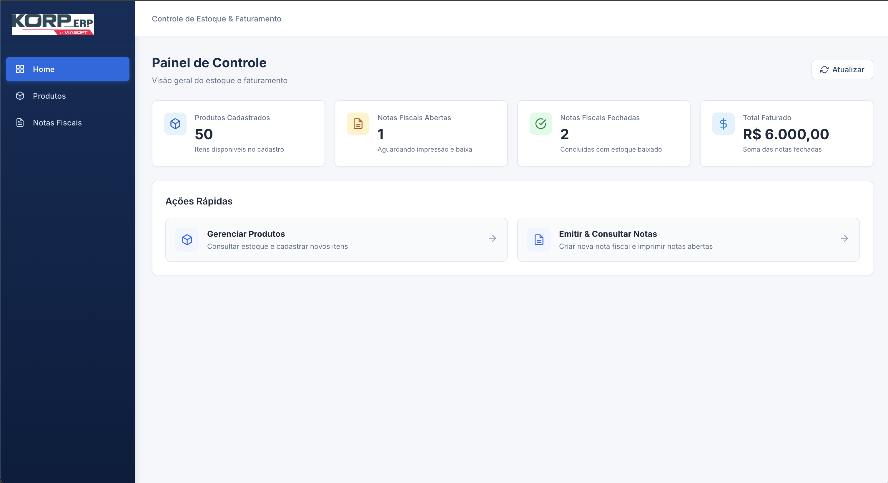
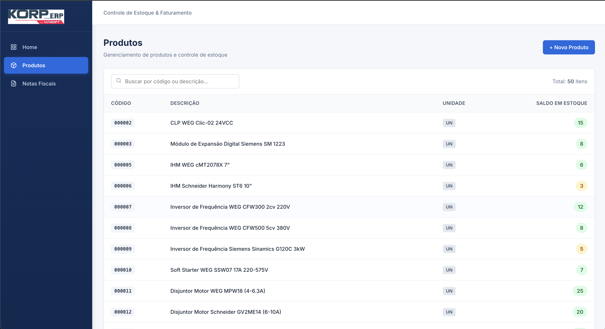
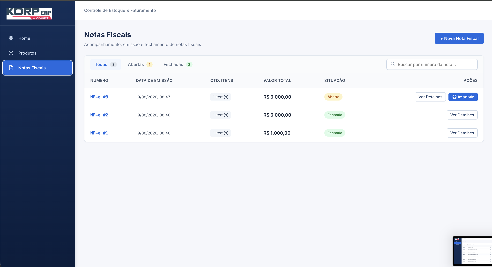
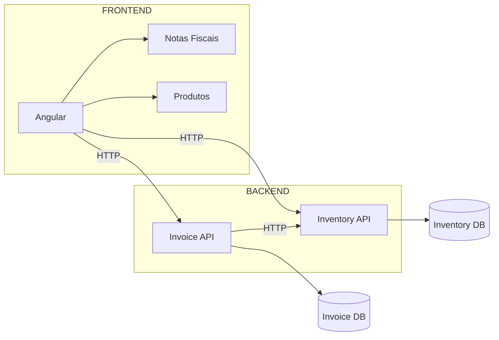

# Korp ERP - Sistema de Emissão de Notas Fiscais & Controle de Estoque

Solução desenvolvida para o teste prático da vaga de **Estágio de Desenvolvimento | C# ou Go (Golang) + Angular** da empresa **KORP INFORMÁTICA LTDA**.

---

## Demonstração da Aplicação

### Painel de Controle (Home)


### Cadastro e Consulta de Produtos


### Emissão e Impressão de Notas Fiscais



---

## Arquitetura da Solução



---

## Tecnologias Utilizadas

### Frontend
- **Angular 22** (Componentes Standalone, Signals, Control Flow nativo `@if`/`@for`)
- **RxJS** (Comunicação assíncrona, Observables e `forkJoin`)
- **Vanilla CSS** (Design system responsivo e moderno sem dependências externas pesadas)
- **Vitest** (Testes unitários automatizados)

### Backend
- **.NET (C# / ASP.NET Core Web API)**
- **Entity Framework Core**
- **LINQ** (Consultas, projeções e validações)
- **PostgreSQL** (Persistência relacional)
- **Docker & Docker Compose** (Orquestração de microsserviços e banco de dados)

---

## Endpoints da API

### 1. Inventory API (`http://localhost:7058`) - Serviço de Estoque
| Método | Endpoint | Descrição | Payload (Exemplo) |
|---|---|---|---|
| `GET` | `/api/products` | Lista todos os produtos cadastrados | - |
| `GET` | `/api/products/{id}` | Consulta produto por ID | - |
| `POST` | `/api/products` | Cadastra novo produto | `{"code":"1001","description":"Sensor PT100 Industrial","unit":"UN","balance":25}` |
| `POST` | `/api/products/consume` | Consome/baixa estoque de produtos | `{"items":[{"productId":1,"quantity":2}]}` |

### 2. Invoicing API (`http://localhost:7077`) - Serviço de Faturamento
| Método | Endpoint | Descrição | Payload (Exemplo) |
|---|---|---|---|
| `GET` | `/api/invoices` | Lista todas as notas fiscais com itens | - |
| `GET` | `/api/invoices/{id}` | Consulta nota fiscal por ID | - |
| `POST` | `/api/invoices` | Emite nova nota fiscal (Situação: Aberta) | `{"items":[{"productId":1,"quantity":2,"unitPrice":150.00}]}` |
| `POST` | `/api/invoices/{id}/print` | Fecha nota e consome estoque no Inventário | - |

---

## Como Executar o Projeto

### 1. Pré-requisitos
- [Docker](https://www.docker.com/) e Docker Compose instalados.
- [Node.js](https://nodejs.org/) (versão 20 ou superior) e npm.

### 2. Executar o Backend e Banco de Dados
Na raiz do repositório, execute:
```bash
docker compose up --build -d
```
- **PostgreSQL**: porta `5432`
- **Inventory API**: `http://localhost:7058`
- **Invoicing API**: `http://localhost:7077`

### 3. Executar o Frontend
Em outro terminal, acesse a pasta do frontend e inicie a aplicação:
```bash
cd frontend
npm install
npm start
```
Acesse a aplicação no navegador em: **`http://localhost:4200`**

### 4. Executar os Testes do Frontend
```bash
cd frontend
npm test -- --watch=false
```
